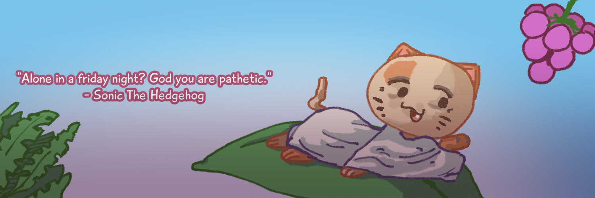
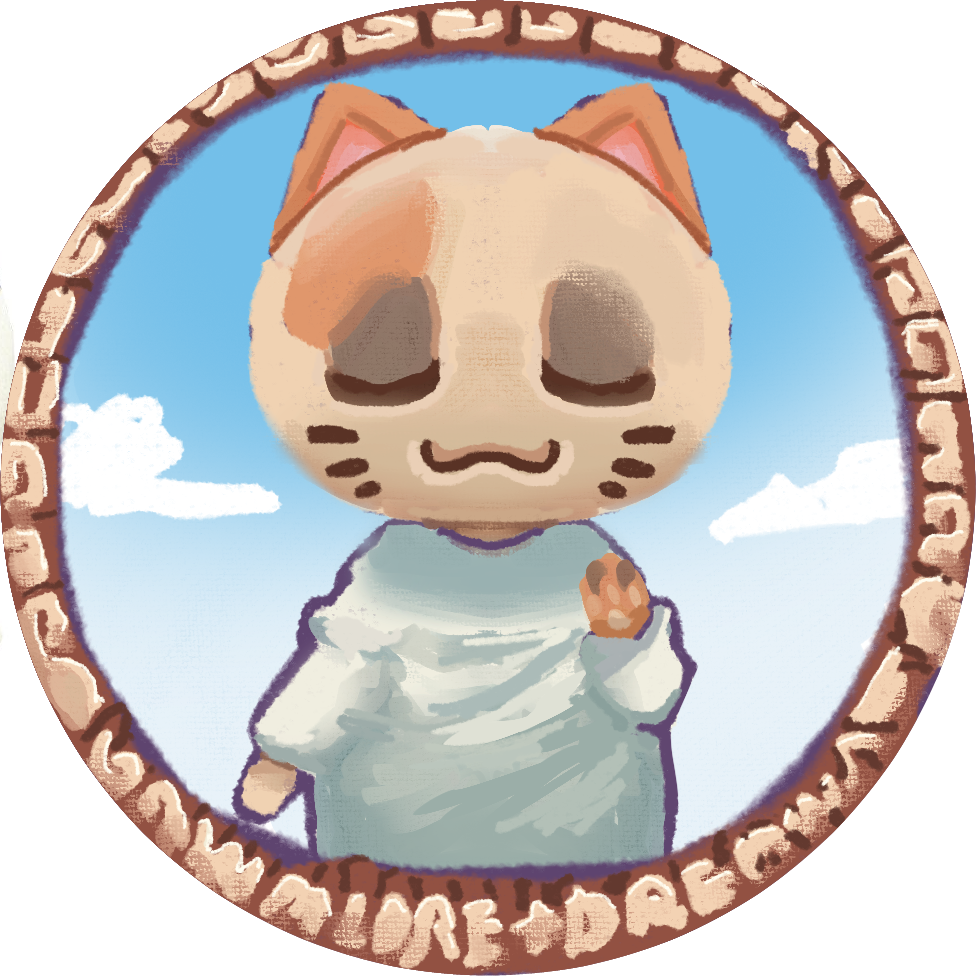
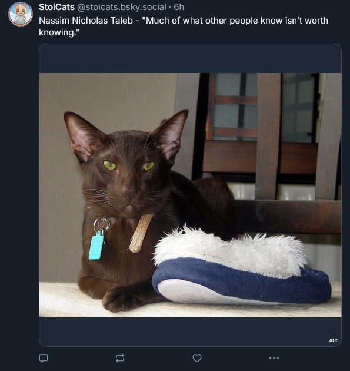
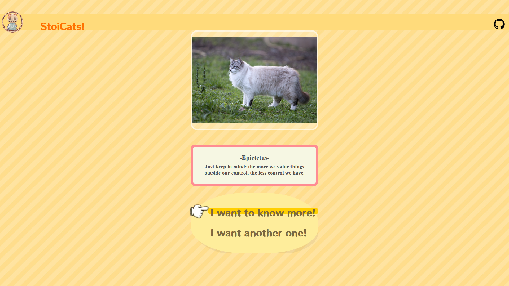
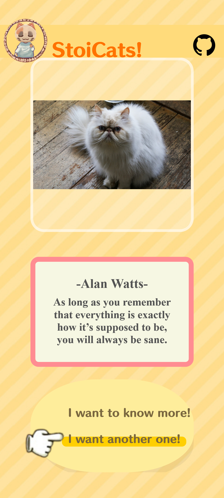

# stoicats 

`Stoicats` is a project that merges stoic quotes with cute looking cat pictures. There is two submodules for bots in this repository. One bot makes posts on `X` (formerly Twitter) and the other one on `BlueSky`. There is another submodule for a `frontend application`.

# Bots

## BlueSky

Here is an example of the bot functioning on bluesky:

It was made with `TypeScript` (node.ts) and runs on a cor job using `Github Actions`.
For more information (how to run, documentation), go to the respective [repository](https://github.com/AndreAnimator/stoicats-bsky.git).

## Twitter

Work in progress.

# App

Here's an example of the app runing on desktop:

Here's an example of the app runing on mobile:

It was made using `Ionic`and `Angular`.
For more information, refer to its [repository](https://github.com/LorenzoPilati/Stoicats.git).